> 欢迎登入 Serial Port Kits(简称SPK)官网 www.gqspark.top 免费下载试用。 新版本5.0正在内测，即将发布！新功能预览请看到最后

   # **1 概述**

   Serial Port Kits（简称SPK）是一款串口通讯软件。与市面上其他同类软件不同的是其设计目标：化繁为简，体验至上。SPK 并不追求繁多的功能，追求的是对每一个功能的用户体验和 UI 细节的打磨。功能的可用性及稳定性是 SPK 的基础，在此基础上， SPK 更加注重的是用户使用体验和视觉体验，例如：用户是否能快速使用软件；配置参数是否方便快捷；是否能智能的对接收的数据进行正确精准的换行；是否能根据输出 log 快速找到异常点以提高 debug 效率；软件运行速度是否够快；UI 界面是否干净简洁但又不失表达等等。

   SPK 的 UI 是其亮点之一，采用了现代化的设计元素，但是为了保持极佳的性能，UI元素的使用上保持了克制，也没有使用更耗性能的动画特性，在美观和性能上做了平衡。我想大多数人都梦寐以求一款颜值拉满又能高效 debug 的工具软件，SPK 也许是个不错的选择。

   **SPK 支持的功能如下：**

   1. 支持自动检测可用串口，不需要手动刷新
   2. 支持串口参数配置，支持任意波特率配置
   3. 支持 ASCII 和 Hex 收发模式
   4. 支持自动添加换行
   5. 支持回显发送的数据
   6. 支持保存 log 到文件
   7. 支持实时输出 log 到文件，对于 log 量大的情况非常有用
   8. 支持时间戳显示
   9. 支持数据高亮显示，在快速定位问题时非常有用
   10. 支持 智能换行
   11. 支持多帧发送和单帧发送，支持记录用户配置的多帧数据，重启软件自动加载
   12. 支持记录历史发送数据
   13. 支持定时发送
   14. 支持 7 种精美皮肤选择，不需要重启即可秒换肤。
   15. 支持中英文
   16. 支持长时间采集波形数据，实时绘制波形数据
   17. 支持百万级波形数据绘制依然流程
   18. 支持保存波形数据到CSV格式，支持 CSV 回放
   19. 支持波形数据测量和统计学分析
   20. 支持6种文件传输协议
   21. **集成 Lua 脚本引擎，赋能任意协议解析，助力协议数据的多方位展示** 【5.0版本新增】
   22. **集成帧组装器，支持定义任意协议格式，快速生成协议帧**【5.0版本新增】
   23. 自动检测软件新版本，安静的提示用户更新

   # **2 软件展示**

   ## **2.1 皮肤**

   7种专业主题可供选择

   - 实验室试验台主题【5.0版本新增】 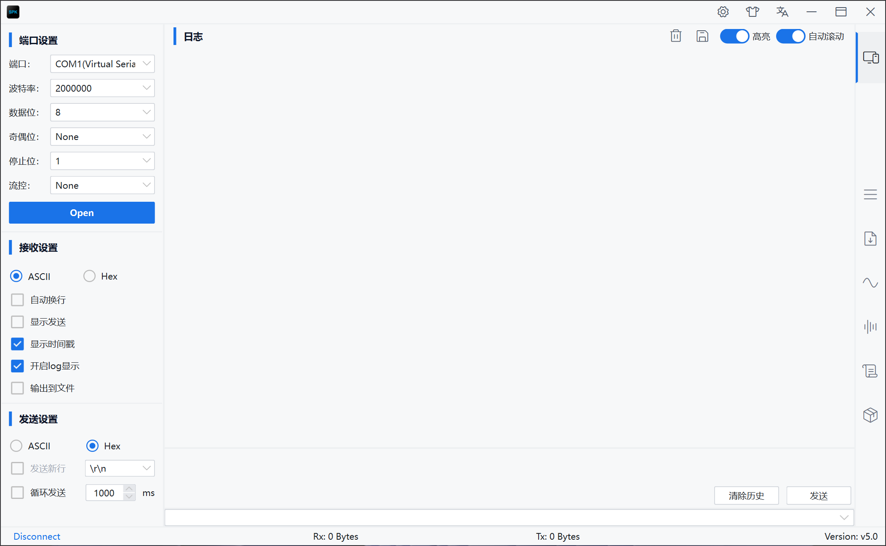
   - 暖色终端主题【5.0版本新增】 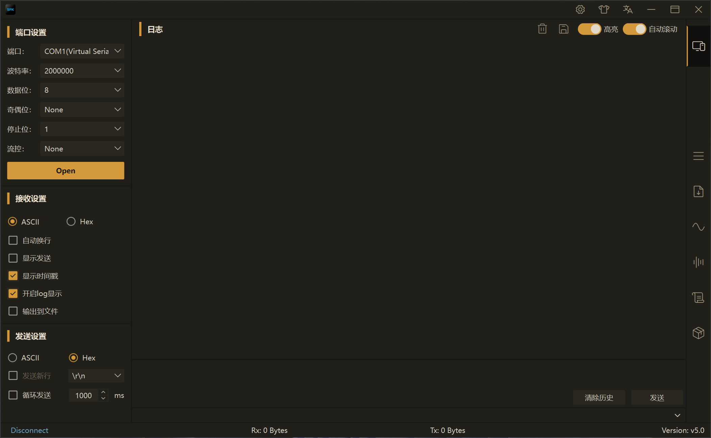
   - 午夜信号主题 【5.0版本新增】 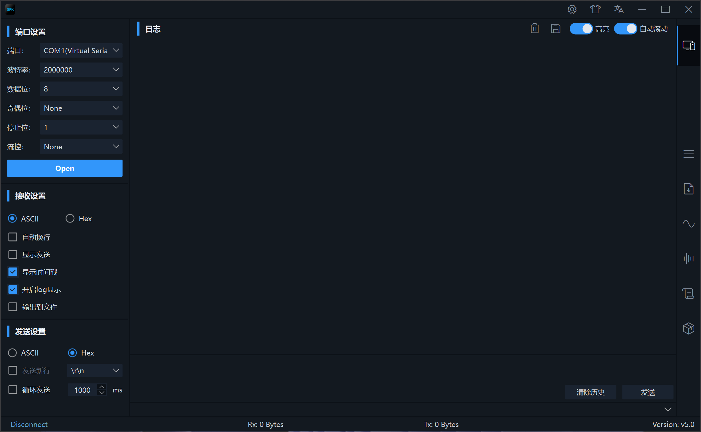
   - 森林实验室主题【5.0版本新增】 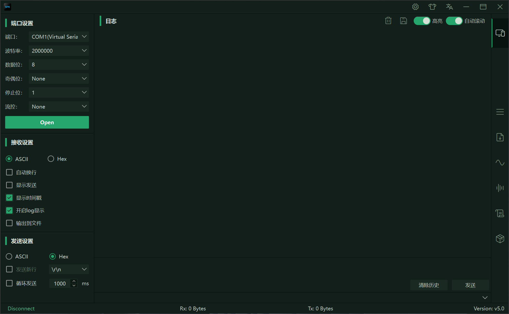
   - 金典暗色主题 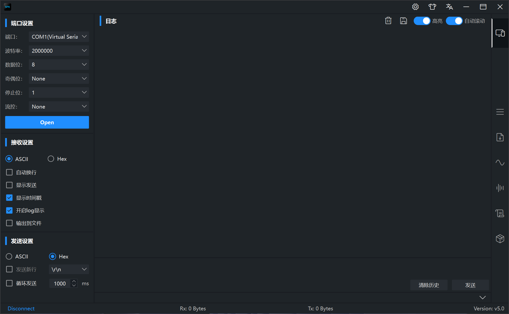
   - 深紫主题 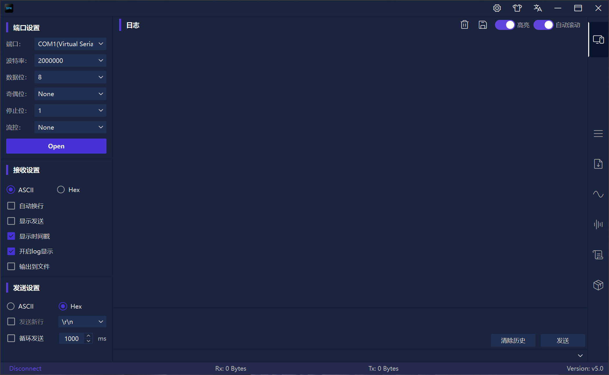
   - 翠绿主题 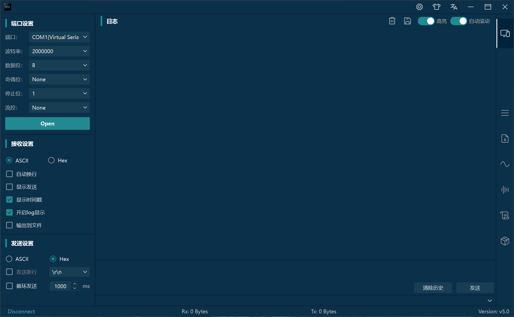

   ## **2.2 功能展示**

   - 数据高亮显示，bug无所遁形 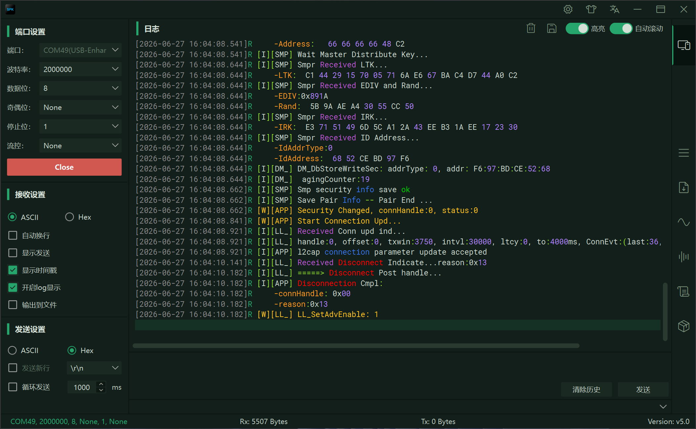
   - 多帧定时发送，实现自动化测试；记录用户配置，一次编辑永久使用；实时追踪当前帧，让用户感知当前状态。 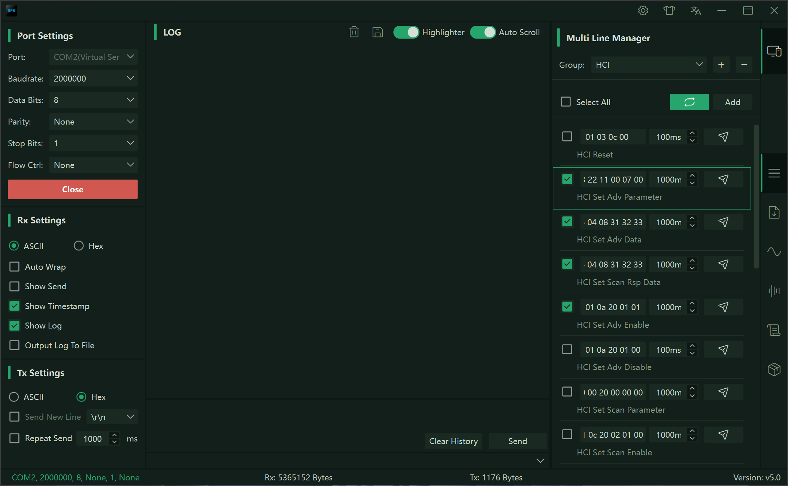
   - 6种常用的文件传输协议随便选 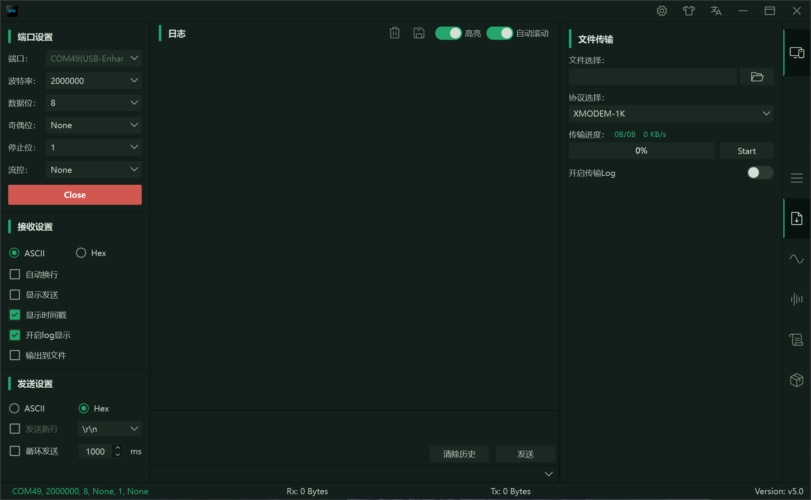
   - 百万级波形数据实时绘制，助你实时监测数据变化；保存数据到CSV格式，方便分发，有助于协同调试 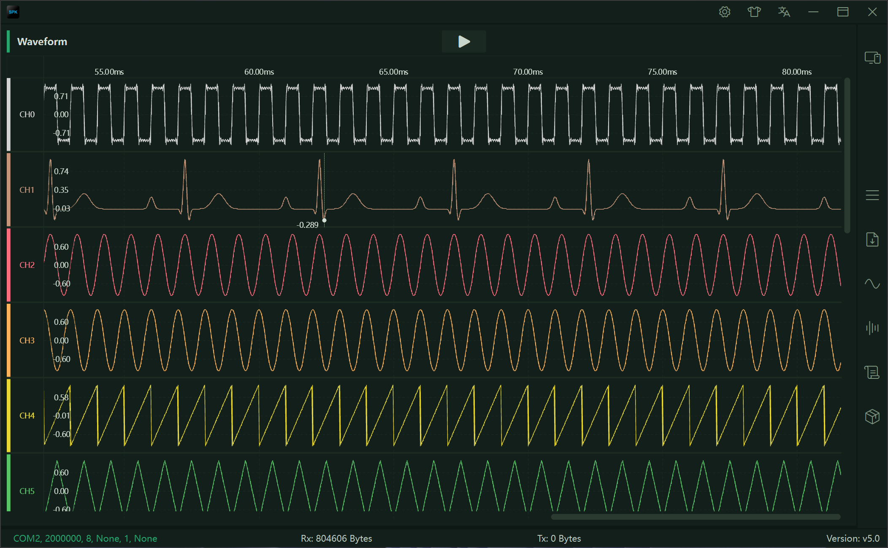
   - 数据测量和统计学计算，让数据更有价值 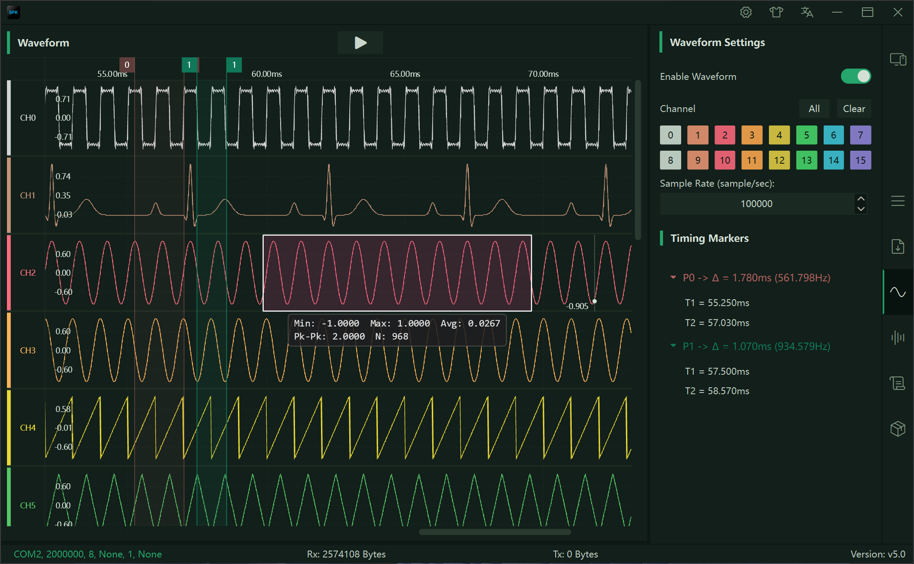
   - 10种常用波形数据发生器，生成模拟测试数据不在求人 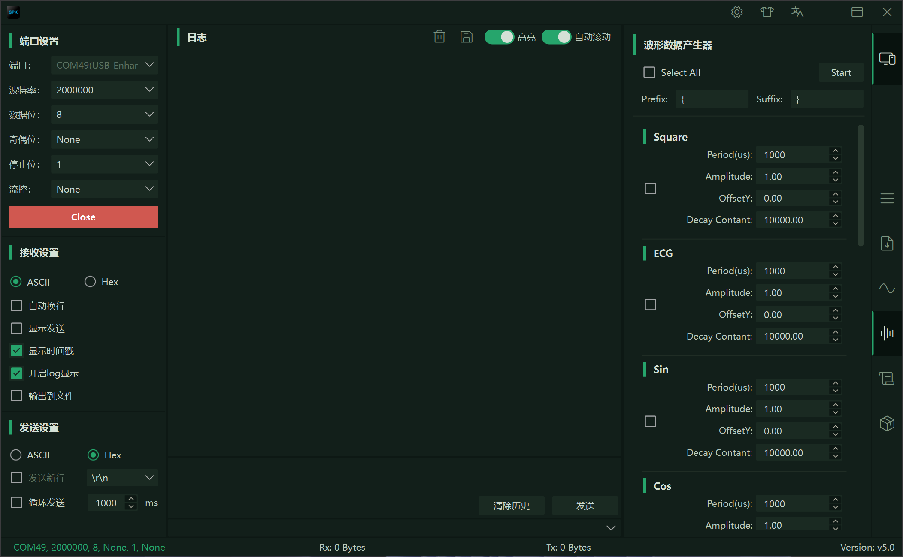
   - 集成 Lua 脚本引擎，赋能任意协议解析，助力协议数据的多方位展示【5.0版本新增】 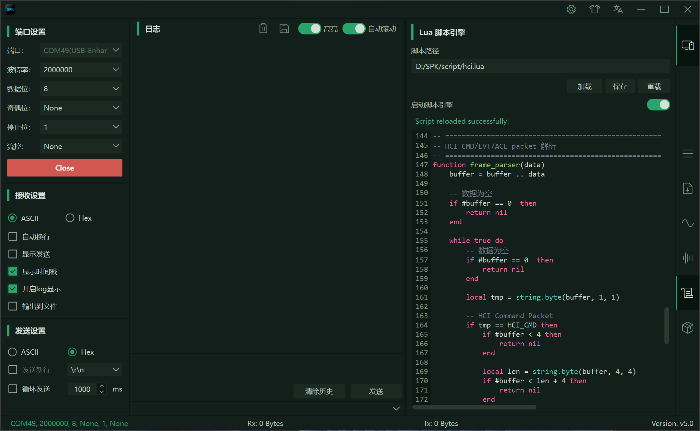
   - 集成帧组装器，支持定义任意协议格式，快速生成协议帧【5.0版本新增】 