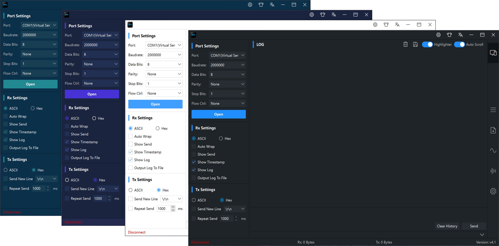
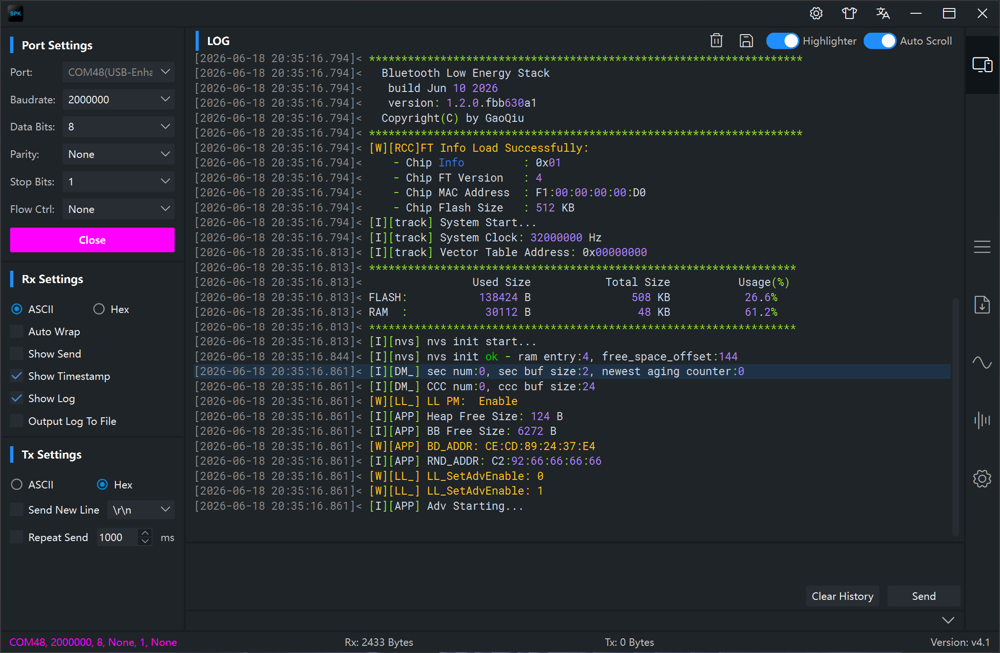
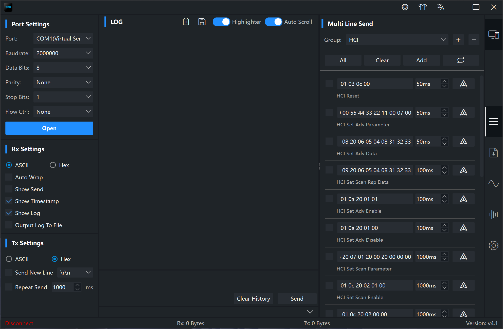
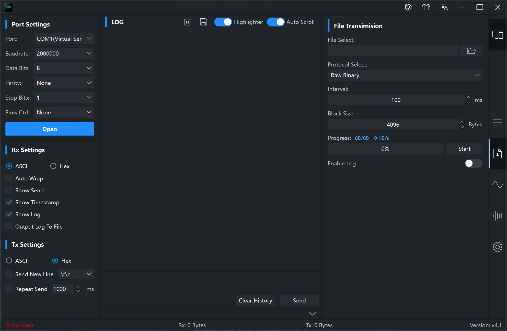
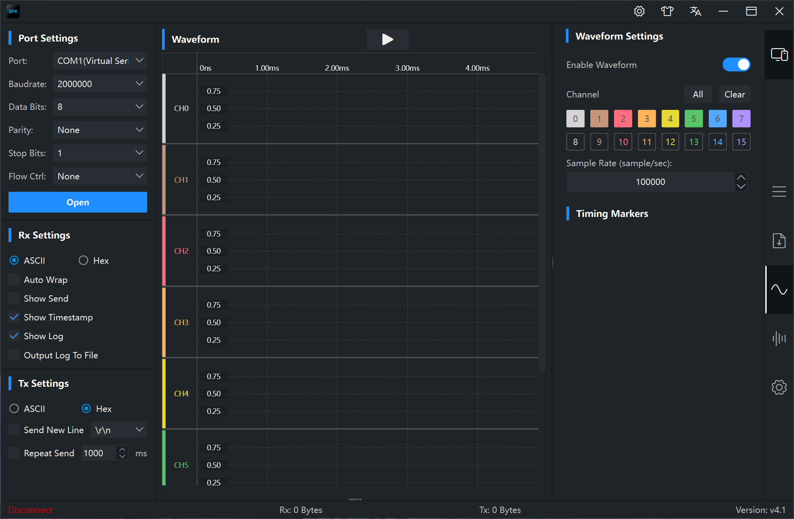
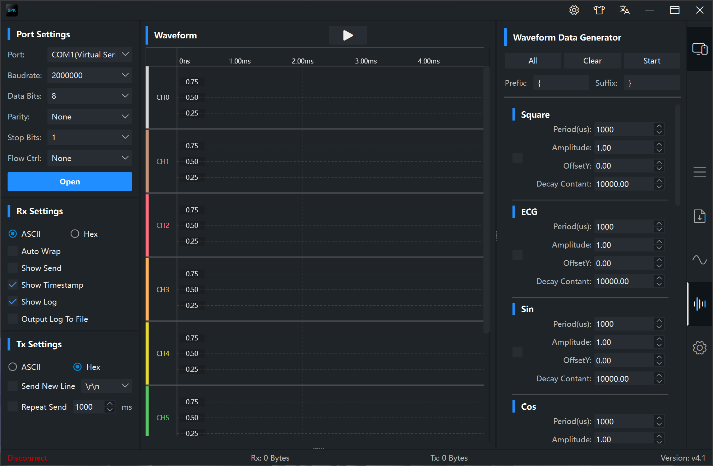
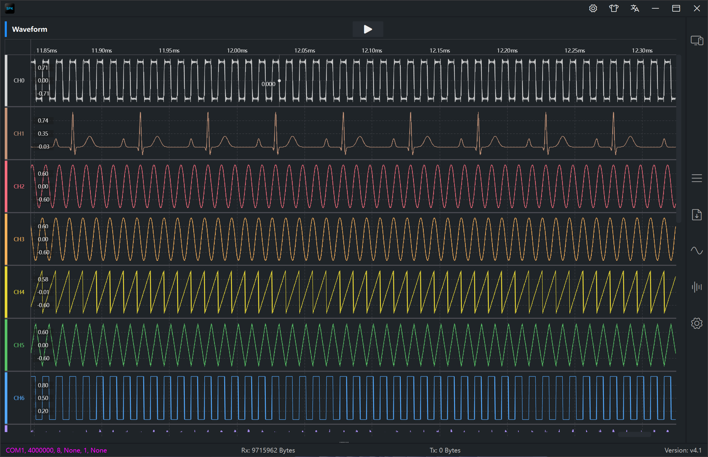
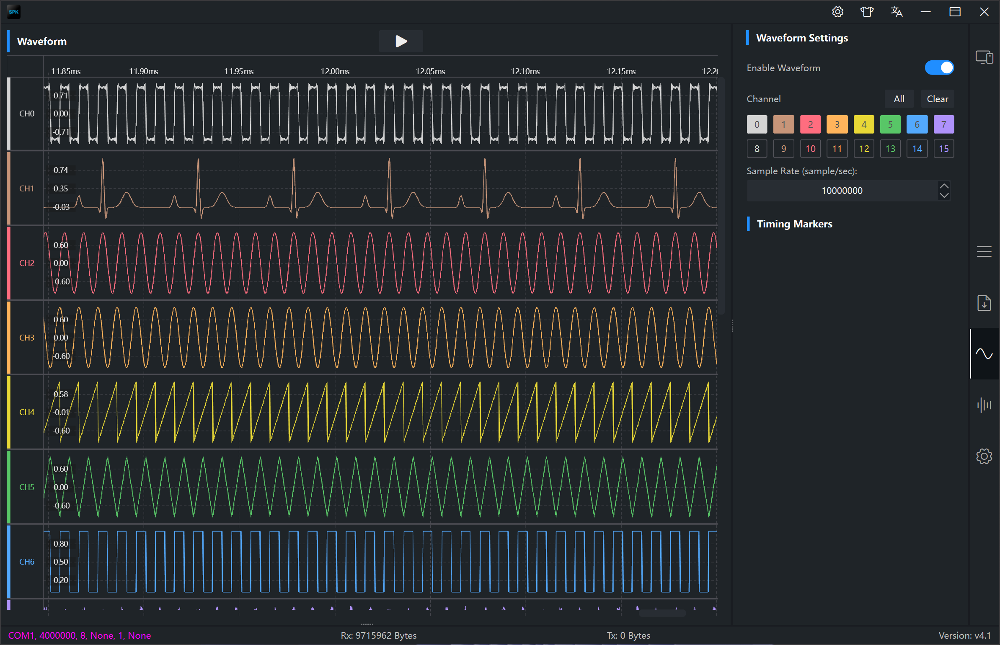
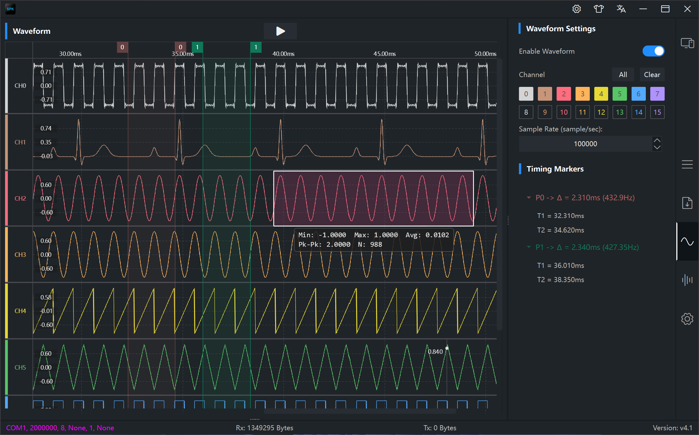

	# 1 概述

SPK（Serial Port Kits）一款串口通讯软件。与市面上其他同类软件不同的是其设计目标：化繁为简，体验至上。SPK 并不追求繁多的功能，追求的是对每一个功能的用户体验和 UI 细节的打磨。功能的可用性及稳定性是 SPK 的基础，在此基础上， SPK 更加注重的是用户使用体验和视觉体验，例如：用户是否能快速使用软件；配置参数是否方便快捷；是否能智能的对接收的数据进行正确精准的换行；是否能根据输出 log 快速找到异常点以提高 debug 效率；软件运行速度是否够快；UI 界面是否干净简洁但又不失表达等等。

​		SPK 的 UI 是其亮点之一，采用了现代化的设计元素，但是为了保持极佳的性能，UI元素的使用上保持了克制，也没有使用更耗性能的动画特性，在美观和性能上做了平衡。我想大多数人都梦寐以求一款颜值拉满又能高效 debug 的工具软件，SPK 也许是个不错的选择。

**SPK 支持的功能如下：**

1. 支持自动检测可用串口，不需要手动刷新
2. 支持串口参数配置，支持任意波特率配置
3. 支持数据接收/发送类型配置，可以配置 ASCII 和 Hex 模式
4. 支持自动添加换行
5. 支持显示发送数据
6. 支持保存 log 到文件
7. 支持直接输出 log 到文件，对于 log 量大的情况非常有用
8. 支持显示时间戳
9. 支持高亮显示接收的数据，在快速定位异常点时非常有用
10. 支持 ASCII mode 下智能换行
11. 支持多行发送和单行发送，支持记录用户配置的多行数据帧
12. 支持记录发送数据的历史
13. 支持定时发送
14. 支持 4 种精美皮肤选择，且不需要重启即可换肤，秒换肤。
15. 支持中文和英文
16. 支持百万级数据实时波形绘制
17. 支持长时间采集波形数据
18. 支持保存波形数据到CSV，并支持CSV重放
19. 支持对波形数据的统计学分析
20. 支持6种文件传输协议

#  2 软件展示

## 2.1 皮肤

## 2.2 接收数据

## 2.3 多行或者多帧发送功能

## 2.4 文件传输

## 2.5 波形功能

